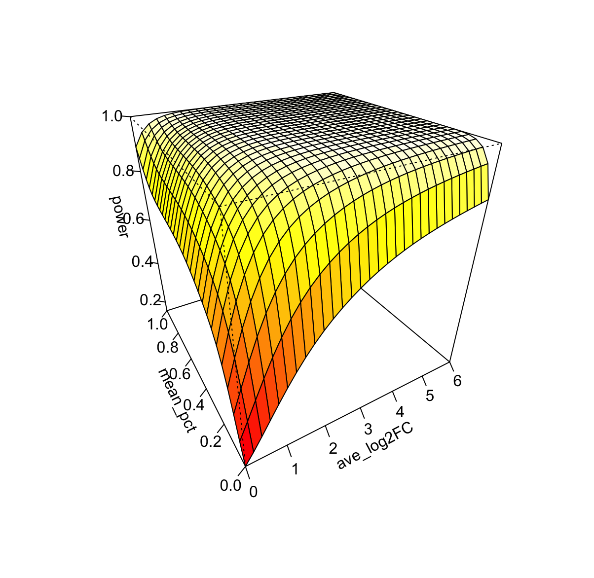

This tutorial is the example analysis with PoweREST on human intraductal papillary mucinous neoplasms (IPMN) data from [GSE233254]("https://www.ncbi.nlm.nih.gov/geo/query/acc.cgi").

## Required input data

`PoweREST` requires 10X spatial transcriptomics data in `Seurat` format.
The example data for runing the tutorial can be downloaded in this [page]()

## Load the package and data
```r
library(PoweREST)
three_areas <- readRDS("~/your_path_to_GSE233293_scMC.all.3areas.final")
Idents(three_areas)
# Levels: Peri Juxta Epi
```
The dataset has three histologically directed spot selection of epilesional, juxtalesional, and perilesional areas. We would like to perform the power estimation upon each of the three areas.

## Preprocess data
```r
# Split the ST data by areas
SeuratObject_splitlist<-SplitObject(three_areas, split.by = "ident")

str(SeuratObject_splitlist[[1]][['Type']])
# Factor w/ 3 levels "LG","HG","IPMNPDAC"

# The original dataset has three cancer subtypes. According to the paper, 'HG' and 'IPMNPDAC' are combined into one 'HR' (high-risk) group
for (i in 1:length(SeuratObject_splitlist)) {
  SeuratObject_splitlist[[i]][['Condition']]<-ifelse(SeuratObject_splitlist[[i]][['Type']]=='LG','LG','HR')
}

# Set identity classes to the 'Condition' column in meta data
for (i in 1:length(SeuratObject_splitlist)) {
  Idents(SeuratObject_splitlist[[i]])<-"Condition"
}
Idents(SeuratObject_splitlist[[1]])
# Levels: HR LG
```

## Power estimation though bootstrapping
```r
# First perform PoweREST upon 'Peri' area
Peri<-SeuratObject_splitlist[[1]]
```
`Test Version`: set 'iteration' to 5, 'replicates' is the sample size per group, 'spots_num' is the average number of spots across the tissue samples which in our case is 80.
```r
test<-PoweREST(Peri,cond='Condition',replicates=5,spots_num=80,iteration=5)
```
`Default Version`: set 'iteration' to 100, it may take hours to run the code if iteration is 100 (default setting). We recommand you install `presto` by
```r
install.packages('devtools')
devtools::install_github('immunogenomics/presto')
# then run this 
result<-PoweREST(Peri,cond='Condition',replicates=5,spots_num=80,iteration=100)
```
### Instead of using Wilcoxon test
The default test in Seurat's `FindMarkers` is Wilcoxon test. Users can specify any test avalible in [FindMarkers](https://satijalab.org/seurat/reference/findmarkers) function.
```r
# For example, use the Student's t-test
result2<-PoweREST(Peri,cond='Condition',replicates=5,spots_num=80,iteration=100,test.use="t")
```
### Power estimation upon a subset of genes
Users can also use `PoweREST_gene` and `PoweREST_subset` to perform the power estimation upon one gene or a subset of genes. But be carefull when interpreting the results, since the power is based on the adjusted p-value after bonferroni correction.

`PoweREST_gene` performs the power calculation upon one gene by specifying the gene name.
```r
one_gene<-PoweREST_gene(Peri,cond='Condition',replicates=5,spots_num=80,gene_name='MUC1',pvalue=0.00001)
```

`PoweREST_subset` performs the power calculation upon a subset of genes by specifying 'logfc.threshold' and 'min.pct' values.
```r
sub_genes<-PoweREST_subset(Peri,cond='Condition',replicates=5,spots_num=80,pvalue=0.05,logfc.threshold = 0.1,min.pct = 0.01)
```

## Fit power surface 
Here, we utilized penalized splines under two-dimentional constraints to fit the power surface.
```r
# Fit the power surface for sample size=5 in each arm
b<-fit_powerest(result$power,result$avg_logFC,result$avg_PCT)

# Get the predition result
pred <- pred.powerest(b,xlim= c(0,6),ylim=c(0,1))
```

## Visualize the surface
```r
vis.powerest(pred,theta=-30,phi=30,color='heat',ticktype = "detailed",xlim=c(0,6),nticks=5)
```


### Create interactive visualization result

```r
plotly_powerest(pred,fig_title='Power estimation result')
```
includeHTML("Rplot.html")
