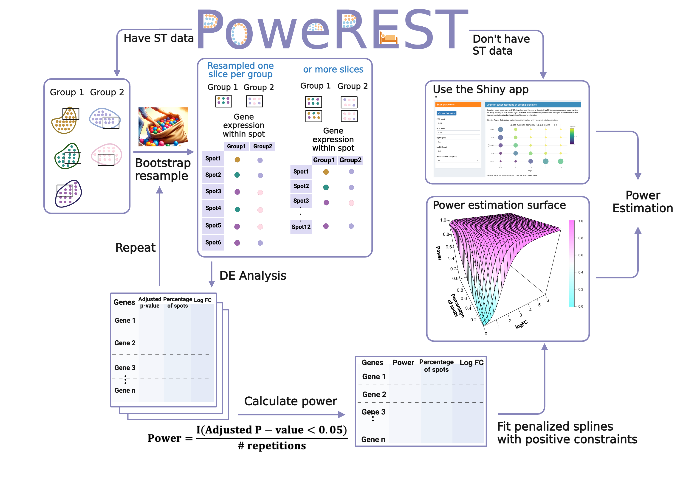

## PoweREST


{:.mt-lg-0}

## Installation
In R or Rstudio
```
# install devtools if necessary
install.packages('devtools')

# install the PoweREST package
devtools::install_github('lanshui98/PoweREST')

# load package
library(PoweREST)
```

If you have problems installing the package, please try to install necessary packages yourself from CRAN.
``` 
install.packages(c("scam","Seurat","dplyr","plotly","resample","fields","patchwork","ggplot2","boot","knitr","rmarkdown","tidyr"))
```

## Introduction to the package
{:.mt-lg-0}

PoweREST is R package for the power analysis of detecting differential expressed genes between two conditions using 10X Visium spatial transcriptomics (ST). It enables the user to estimate the power or sample size needed for a 10X Visium ST experiment with and without prior dataset available by depicting how the study power is determined by three key parameters: (i) the number of biological replicates; (ii) the percentage of spots where the gene is detected in both groups; (iii) the log-fold change in average expression between two groups. PoweREST relies fully upon non-parametric modelling techniques but under biologically meaningful constraints which is extremely suitable for complex ST samples. The tool has been evaluated upon data from different tissue samples with promising and robust results.

### Cite PoweREST

### Contact us

### Acknowledgemen
This work was in part funded by the Translational and Basic Science Research in Early Lesions ([TBEL](https://www.tbelprogram.org/index.html)) Program. This website is build based on [CARD's tutorial](https://yma-lab.github.io/CARD/) by Dr Ying Ma.
